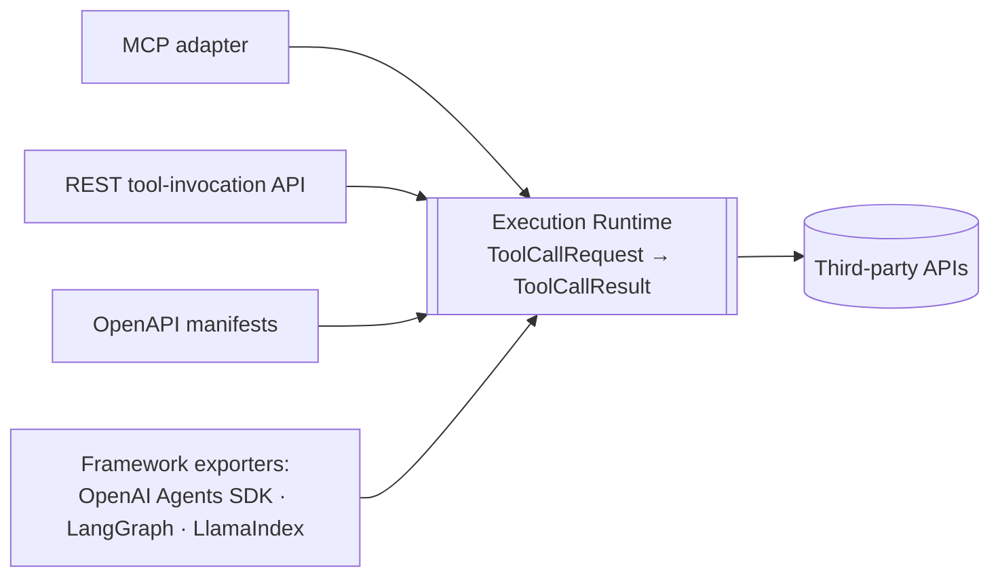

# AI Runtime — Execution Runtime

> Consistent with docs/MASTER_PROJECT_BIBLE.md. Bible tenet 3: **the runtime is the
> only egress** — no code outside the Execution Runtime may call a customer's
> third-party API. Adapters stay thin per tenet 4.
>
> Version 1.0 · 2026-08-02

The Execution Runtime is product pillar 2 (Bible §3). Every Tool Call from every
Interface — MCP, REST tool-invocation, OpenAPI manifests, framework SDKs — funnels
through this one pipeline. It lives in the `runtime` domain of the modular monolith
and is the single place where auth injection, policy, rate limiting, audit, and
outbound HTTP happen.

## 1. Contracts

Adapters translate their protocol into exactly one request/result pair. These are
internal Pydantic models (versioned with the codebase, not a wire format):

```python
class ToolCallRequest(BaseModel):
    request_id: str            # correlation id, propagated to logs and audit
    workspace_id: UUID
    caller: CallerIdentity     # interface type + api_token_id | member_id
    tool_name: str             # canonical Tool name (CONNECTOR_ENGINE.md §5)
    connection_id: UUID | None # explicit, or resolved from tool_name if unambiguous
    arguments: dict[str, Any]  # validated against the Tool's input_schema
    mode: Literal["sync", "async"] = "sync"
    confirmation_token: str | None  # for destructive operations (§7)

class ToolCallResult(BaseModel):
    request_id: str
    tool_call_id: UUID         # the audit row (tool_calls table)
    status: Literal["succeeded", "failed", "denied", "timeout", "pending"]
    content: ToolContent | None    # normalized, truncated payload for LLM consumption
    error: ToolError | None        # stable code + safe message, never raw upstream body
    usage: CallUsage               # duration_ms, bytes_in/out
```

`pending` appears only in async mode (§5). Nothing else about the contract differs
between sync and async — adapters have no other branch to write.

## 2. Execution pipeline

Every call passes the same ordered stages; the first failing stage short-circuits to a
denied/failed result and still writes the audit row.

1. **Authenticate caller** — resolve the workspace-scoped api token (or the session
   Member for dashboard "test call") into a `WorkspaceContext` (ADR-0002). Revoked or
   expired tokens stop here.
2. **Resolve Tool + Connection** — look up the Tool by canonical name within the
   workspace and bind the Connection (explicit `connection_id`, else the single
   active Connection for the Connector; ambiguity is an error, never a guess).
   Arguments are validated against the Tool's `input_schema` — malformed input never
   reaches the wire.
3. **Policy checks** — in order: Tool and Connection `enabled`; caller role/token
   scope allows this Tool; per-workspace **rate limit** (Redis token bucket,
   `ws:{workspace_id}:rl:*`, seeded from the Tool's `rate_hints`); plan **quota**
   (metered Tool Calls, Bible §11). Redis down → fail closed on quota-relevant checks
   (SYSTEM_ARCHITECTURE.md §7). Destructive Tools additionally require confirmation (§7).
4. **Credential injection** — decrypt the Connection's Credential **in memory only**
   (Bible tenet 2): unwrap the DEK, decrypt, inject per the auth model
   (CONNECTOR_ENGINE.md §8), zero references immediately after the request is built.
   Plaintext never touches logs, the audit row, or the result.
5. **Outbound call** — httpx (async) with per-call **timeout** (default 30s),
   **bounded retries with jitter for idempotent operations only**, and a
   **circuit breaker per Connection** (SYSTEM_ARCHITECTURE.md §7): repeated upstream
   failures open the circuit and fail fast until a probe succeeds. Egress allowlist
   enforced here (§7).
6. **Response normalization** — shape the upstream response for LLM consumption using
   the Tool's `output_hints`: content-type handling, error mapping to stable codes,
   **truncation** of oversized bodies to a per-call byte budget with an explicit
   `truncated: true` marker and a pointer for retrieving the full payload (R2, bounded
   TTL). Binary responses become typed references, never inline blobs.
7. **Audit + usage** — write the `tool_calls` audit row (redacted input/output
   summaries — DATABASE_DESIGN.md) and emit a `usage_events` row for billing; publish
   `tool_call.completed` on the event bus. This stage is not optional and not
   best-effort: no audit row, no result.

## 3. Sync vs async execution

- **Sync (default):** the pipeline runs inline within the API request; suits calls
  completing within the interface's patience window.
- **Async:** for long-running upstream operations (or when the adapter requests it),
  stages 1–3 run inline — fast rejection stays synchronous — then a Celery task
  (`runtime` queue, idempotent, `workspace_id` + `request_id` in payload per
  BACKEND_SPEC.md §5) executes stages 4–7. The caller receives `status: pending` +
  `tool_call_id`, then either **polls** `GET /v1/tool-calls/{id}` or registers a
  **webhook** delivered via `webhooks_outbox`. Interfaces that cannot poll (some MCP
  clients) hold the connection and stream the result when transport allows
  (MCP_RUNTIME.md).

## 4. One runtime, many doors



## 5. Agent-framework layer

The frameworks in the stack (Bible §7) are consumed via **exporters** over the same
runtime — never parallel execution paths:

- **OpenAI Agents SDK:** each Tool exports as a function tool whose handler builds a
  `ToolCallRequest` and returns the normalized `content`.
- **LangGraph:** Tools export as LangChain-compatible tool objects for graph nodes;
  the tool `func` is the same thin wrapper.
- **LlamaIndex:** Tools export as `FunctionTool`s for agents/query engines,
  identically wrapped.

Exporters generate schemas from the canonical Tool Schema (ADR-0003) and contain zero
policy logic — a framework wrapper with an `if` is a smell (Bible tenet 4). Agent
orchestration products built on these frameworks are downstream consumers; the runtime
neither knows nor cares which framework called it.

## 6. Failure semantics

| Condition | Result status | Notes |
|---|---|---|
| Policy denial (disabled, role, rate, quota) | `denied` | Stable `error.code` (`rate_limited`, `quota_exceeded`, …); retry guidance in `error` |
| Upstream 4xx | `failed` | Sanitized upstream detail; never verbatim body |
| Upstream 5xx after retries / circuit open | `failed` | `error.code: upstream_unavailable`; circuit state noted |
| Timeout | `timeout` | Upstream side effects unknown — surfaced honestly to the caller |

All four still produce audit rows; `denied` calls are the cheapest and the most
security-interesting.

## 7. Safety

- **Destructive-operation confirmation.** Tools annotated `destructive: true`
  (CONNECTOR_ENGINE.md §6) are policy-gated per workspace: `allow` (power users),
  `confirm` (default), or `block`. In `confirm` mode the first call returns `denied`
  with `error.code: confirmation_required` and a short-lived, single-use
  `confirmation_token` bound to the exact tool + argument hash; the caller (human in
  the loop, or the AI surface's elicitation flow) re-submits with the token. Changing
  the arguments invalidates the token — no bait-and-switch.
- **Per-workspace egress allowlists.** Outbound requests may only target hosts derived
  from the Connection's Connector `base_url` plus explicitly allowlisted additions.
  Redirects are re-checked against the allowlist; private/link-local address ranges
  are always denied (SSRF hardening). Enforced at stage 5, inside the runtime, where
  it cannot be bypassed (tenet 3).
- **Prompt injection in tool outputs.** Third-party responses are untrusted data that
  will be read by an LLM. The runtime cannot make text safe, but it constrains blast
  radius: outputs are returned as data (typed content, never re-interpreted as
  instructions by our layer), truncation limits payload size, and control characters /
  invisible Unicode are stripped during normalization. The layered defenses —
  destructive-op confirmation, egress allowlists, per-token Tool scoping — ensure that
  even a fully hijacked model turn can only do what the workspace's policy already
  permits. Documented threat model: SECURITY.md.
- **Secrets discipline.** Stage 4 is the only decryption point in the entire codebase;
  audit summaries are produced by a redactor that strips credential material and
  known-sensitive keys before persistence (BACKEND_SPEC.md §7).
