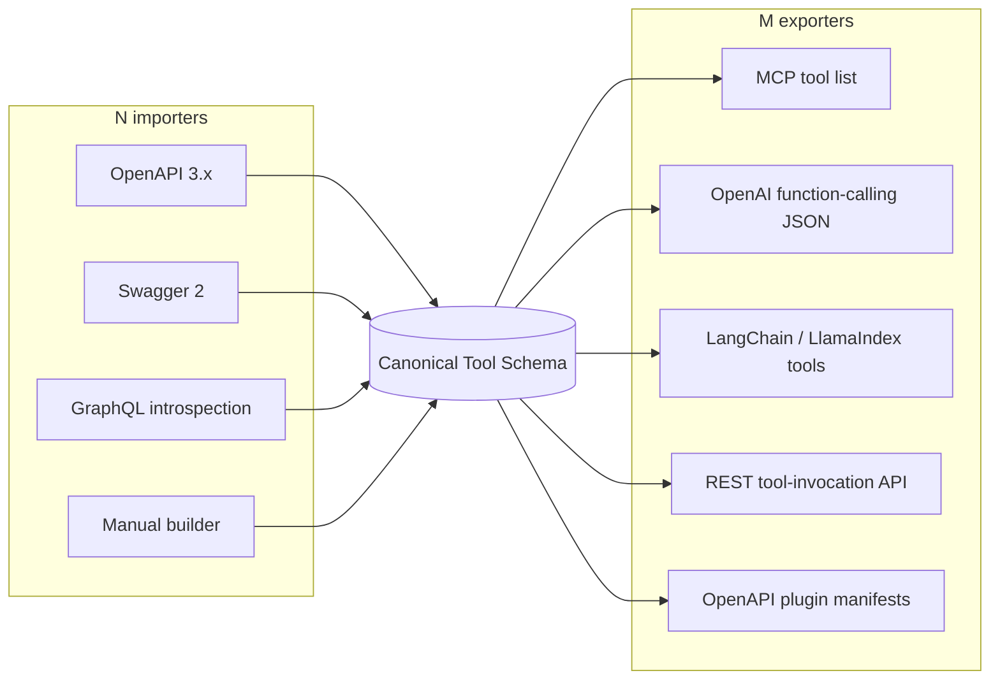

# Connector Engine

> Consistent with docs/MASTER_PROJECT_BIBLE.md. Hub-and-spoke contract per ADR-0003;
> storage model per docs/DATABASE_DESIGN.md (`connectors`, `connector_versions`,
> `tools`, `credentials`).
>
> **This document is the overview.** The authoritative engineering specification —
> full Tool Schema, lifecycle state machine, auth models, retries, rate limiting,
> plugin architecture — is [CONNECTOR_SPECIFICATION.md](CONNECTOR_SPECIFICATION.md);
> on conflict for connector internals, the specification wins.
>
> Version 1.0 · 2026-08-02

The Connector Engine is product pillar 1 (Bible §3): it ingests any API description,
normalizes it into the **canonical Tool Schema**, and manages the credential lifecycle.
It produces Connectors and Tools; it never executes them — execution belongs to the
Execution Runtime (AI_RUNTIME.md).

## 1. Hub-and-spoke (ADR-0003)

N input formats and M output surfaces must not become N×M converters. Everything
normalizes to one internal Tool Schema; importers and exporters are spokes.



The Tool Schema is **versioned**; changing it requires an ADR (ADR-0003 consequence).
Exporters live in `interfaces/` and stay thin (Bible tenet 4); importers live in the
`connectors` domain.

## 2. Canonical Tool Schema

Fields of one Tool (one operation of a Connector):

| Field | Type | Meaning |
|---|---|---|
| `name` | string | Canonical tool name (§5). Stable across re-syncs when the operation is unchanged. |
| `description` | string | LLM-facing description, from spec summary/description, cleaned for prompt use. |
| `input_schema` | JSON Schema (draft 2020-12) | Parameters merged into one object: path/query/header params + request body. |
| `output_hints` | object | Response shape guidance: content type, top-level fields, pagination style. Hints, not a contract — used for normalization/truncation (AI_RUNTIME.md). |
| `auth` | object | What the operation needs from the Connection's auth model (e.g. scopes for oauth2). Requirements only — never secret material. |
| `rate_hints` | object | Declared/observed limits: `requests_per_minute`, `burst`, `concurrency`. Advisory input to runtime rate limiting. |
| `tags` | string[] | Grouping/search facets from spec tags plus importer heuristics. |
| `annotations` | object | Safety metadata (§6): `readonly`, `destructive`, `idempotent`. |
| `extensions` | object | Source-format bag for round-trip fidelity (per ADR-0003): raw operationId, GraphQL field path, vendor `x-*` keys. Exporters ignore it. |

Example:

```json
{
  "name": "stripe_create_refund",
  "description": "Create a refund for a charge or payment intent.",
  "input_schema": {
    "type": "object",
    "properties": {
      "payment_intent": { "type": "string", "description": "ID of the PaymentIntent to refund." },
      "amount": { "type": "integer", "description": "Amount in cents. Omit for full refund." },
      "reason": { "type": "string", "enum": ["duplicate", "fraudulent", "requested_by_customer"] }
    },
    "required": ["payment_intent"]
  },
  "output_hints": { "content_type": "application/json", "top_fields": ["id", "status", "amount"] },
  "auth": { "type": "bearer" },
  "rate_hints": { "requests_per_minute": 100 },
  "tags": ["payments", "refunds"],
  "annotations": { "readonly": false, "destructive": true, "idempotent": false },
  "extensions": { "openapi": { "operationId": "PostRefunds", "method": "POST", "path": "/v1/refunds" } }
}
```

## 3. Importers

1. **OpenAPI 3.x** — the reference importer. One Tool per operation; `$ref` resolution,
   composition (`allOf`/`oneOf`) flattened where LLM-safe, parameter + requestBody
   merged into `input_schema`; `security` requirements mapped to `auth`.
2. **Swagger 2** — converted to OpenAPI 3 first (single upgrade step), then the
   OpenAPI 3 importer runs. No separate normalization logic to maintain.
3. **GraphQL introspection** — introspection query against the endpoint; each
   top-level query/mutation field becomes a Tool (queries → `readonly: true`,
   mutations → reviewed as potentially destructive). Arguments map to `input_schema`;
   selection sets are generated at sensible default depth and recorded in `extensions`.
4. **Manual builder** — dashboard form for undocumented REST APIs: method, URL
   template, params, auth, description. Produces the same Tool Schema, so a manual
   Connector is indistinguishable downstream.

## 4. Validation and normalization pipeline

Ingestion runs as a Celery pipeline (`ingestion` queue, idempotent per BACKEND_SPEC.md
§5), triggered on create and re-sync:

1. **Fetch** the spec (URL or upload; original stored in R2, referenced by
   `connector_versions.raw_spec_ref`).
2. **Validate** against the format's spec; hard errors fail the run with actionable
   messages surfaced in the dashboard (`connectors.status = failed`).
3. **Normalize** to Tool Schemas: name generation (§5), description cleanup, schema
   flattening, auth/rate extraction, annotation inference (§6).
4. **Lint** — warnings, not failures: missing descriptions, anonymous schemas,
   suspiciously broad operations. Shown in the dashboard for the user to fix upstream.
5. **Persist** a new immutable `connector_version` + `tools` rows; compute
   `diff_summary`; publish `connector.ingested` on the event bus (invalidates tool-list
   caches, MCP_RUNTIME.md §4).

If the normalized content hash (`spec_hash`) matches the current version, the pipeline
stops — no empty versions.

## 5. Tool naming and dedup rules

- Canonical name: `{connector_slug}_{operation_slug}` — lowercase snake_case, ≤ 64
  chars (the strictest exporter budget), so names are collision-free across a
  workspace's Connections when exported side by side.
- Operation slug precedence: sanitized `operationId` → GraphQL field name → generated
  `{method}_{path_tokens}`. Duplicates within one Connector get deterministic `_2`,
  `_3` suffixes (stable across re-syncs — ordering by spec position).
- **Identity across versions** keys on `extensions` source identity (operationId /
  field path), not the display name: a re-described operation keeps its Tool identity;
  a renamed operationId is a remove + add in the `diff_summary`.

## 6. Safety annotations

Every Tool carries `annotations` used by the runtime's policy checks and
confirmation flow (AI_RUNTIME.md §7):

- `readonly: true` — inferred for GET/HEAD and GraphQL queries.
- `destructive: true` — inferred for DELETE, and for POST/PUT/PATCH whose
  operation names/paths match destructive heuristics (delete, cancel, revoke, refund…).
- `idempotent` — from HTTP method semantics plus spec hints.
- Inference is a starting point: users can override annotations per Tool in the
  dashboard, and overrides survive re-sync (stored against Tool identity, not version).
  When in doubt, the importer marks destructive — false caution is cheaper than a
  false all-clear.

## 7. Connector versioning

- `connector_versions` are **immutable** (DATABASE_DESIGN.md): every successful
  ingestion appends a version; nothing is edited in place. `connectors.current_version_id`
  is the only moving pointer.
- **Diffing:** each version stores a `diff_summary` (tools added / removed / changed,
  input-schema-breaking changes flagged) rendered in the dashboard before the user
  promotes the version.
- **Re-sync:** manual ("Sync now") or scheduled for URL-sourced specs. Re-sync never
  auto-promotes when the diff removes or breaks Tools that active Connections use —
  the user confirms; purely additive diffs may auto-promote per Connector setting.
- Existing Connections keep working across promotion because Tool identity (§5) is
  stable; removed Tools are soft-deleted and start failing with a clear
  `tool_not_found` policy error rather than silently vanishing mid-conversation.

## 8. Auth models supported

Auth is declared on the Connector (requirements) and satisfied by a Connection's
Credential (encrypted per Bible tenet 2; storage per DATABASE_DESIGN.md `credentials`).

| Model | Variants | Notes |
|---|---|---|
| `api_key` | header or query parameter | Key name + location declared on the Connector; value in the Credential. Query-param keys are redacted from all logs/audit summaries. |
| `bearer` | static token | `Authorization: Bearer <token>`. |
| `basic` | username + password | Encoded at injection time, never stored pre-encoded. |
| `jwt` | static; signed | Static: user-supplied long-lived JWT. Signed: we hold the signing key and mint short-lived JWTs per call (claims template on the Connector). |
| `oauth2` | authorization code; client credentials | Full dance in the dashboard for auth code. Tokens + refresh tokens encrypted in the Credential. A **token refresh worker** (Celery, `runtime` queue) refreshes ahead of `credentials.expires_at`; refresh failure flips the Connection to `error` and notifies via `webhooks_outbox`. |
| `custom_headers` | arbitrary header set | For APIs with bespoke schemes (e.g. `X-Api-Key` + `X-Api-Secret` pairs). Entire header map lives in the Credential. |

Credential plaintext is decrypted **only inside the Execution Runtime at injection
time** — the Connector Engine handles ciphertext and metadata exclusively.
