# Connector Engine — Full Specification

> Consistent with docs/MASTER_PROJECT_BIBLE.md. Expands docs/CONNECTOR_ENGINE.md (overview) into the authoritative engineering specification. On conflict, this spec wins for connector internals; ADR-0003 governs the hub-and-spoke contract.
>
> Version 1.0 · 2026-08-02 · Owners: Uday (CEO), Claude (CTO)

---

## 1. Vision & Goals

The Connector Engine is product pillar 1 (Bible §3) and the company's moat. AI surfaces are commodities that churn quarterly; APIs and the Credentials that unlock them are sticky. Whoever holds the canonical, normalized, safety-annotated description of a customer's API estate — bound to working Credentials — owns the integration layer that every current and future AI surface must pass through. The engine's job is to make that canonical layer so accurate, so tolerant of messy real-world specs, and so cheap to extend (N importers + M exporters, never N×M, per ADR-0003) that reproducing it is a multi-year effort for anyone else.

**Goals.** Ingest any API description into one canonical Tool Schema; preserve enough source fidelity for round-trips (`extensions`); annotate every Tool for safety; manage Connector versions immutably; declare (never hold) auth requirements; hand the Execution Runtime everything it needs to execute a Tool Call without re-reading a source spec.

**Non-goals.** The engine never executes a Tool Call, never decrypts a Credential, and never talks to a customer's API except to fetch a spec or run GraphQL introspection (both under the SSRF rules in §11/§18). It is not a workflow engine (ROADMAP.md parking lot), not a gateway/reverse proxy, and not an API-design tool — we normalize what exists; we do not author upstream APIs.

## 2. Universal Tool Schema

The canonical Tool Schema is the hub of ADR-0003. docs/CONNECTOR_ENGINE.md §2 summarizes its fields; this section is the normative definition. The overview's example stores raw source coordinates in `extensions` for round-trip fidelity; execution binding is the first-class `endpoint` field below — `extensions` remains source-only and exporters continue to ignore it.

```json
{
  "$schema": "https://json-schema.org/draft/2020-12/schema",
  "$id": "https://omniaiconnect.com/schemas/tool/1.0.0",
  "title": "Tool",
  "type": "object",
  "required": ["name", "description", "input_schema", "endpoint", "annotations"],
  "properties": {
    "id": { "type": "string", "format": "uuid",
      "description": "UUIDv7 of the persisted tools row (DATABASE_DESIGN.md). Absent pre-persist." },
    "name": { "type": "string", "maxLength": 64, "pattern": "^[a-z][a-z0-9_]*$",
      "description": "Canonical name: {connector_slug}_{operation_slug} (CONNECTOR_ENGINE.md §5)." },
    "schema_version": { "type": "string",
      "description": "Semver of this Tool Schema definition, e.g. \"1.0.0\" (§13)." },
    "connector_version": { "type": "integer",
      "description": "Monotonic connector_versions.version this Tool belongs to." },
    "description": { "type": "string", "maxLength": 4096,
      "description": "LLM-facing description, sanitized per §18." },
    "llm_hints": { "type": "object",
      "properties": {
        "when_to_use": { "type": "string" },
        "when_not_to_use": { "type": "string" },
        "argument_examples": { "type": "array", "items": { "type": "object" }, "maxItems": 3 }
      },
      "description": "Optional prompt-quality extras; exporters may fold into description." },
    "input_schema": { "$ref": "https://json-schema.org/draft/2020-12/schema",
      "description": "One object schema: path/query/header params + request body merged." },
    "output_hints": { "type": "object",
      "properties": {
        "content_type": { "type": "string" },
        "top_fields": { "type": "array", "items": { "type": "string" } },
        "item_path": { "type": "string", "description": "JSON pointer to the list items, e.g. \"/data\"." },
        "truncation": { "type": "object",
          "properties": {
            "max_bytes": { "type": "integer", "default": 65536 },
            "keep": { "type": "array", "items": { "type": "string" },
              "description": "Fields preserved verbatim when truncating." }
          }
        }
      },
      "description": "Hints, not a contract; consumed by runtime normalization (docs/AI_RUNTIME.md §2.6)." },
    "auth": { "type": "object",
      "properties": {
        "required": { "type": "boolean", "default": true },
        "scopes": { "type": "array", "items": { "type": "string" } }
      },
      "description": "Per-operation requirements against the Connector's auth_config (§5). Never secret material." },
    "endpoint": { "type": "object",
      "required": ["method", "url"],
      "properties": {
        "method": { "enum": ["GET", "POST", "PUT", "PATCH", "DELETE", "HEAD"] },
        "url": { "type": "string",
          "description": "Template relative to the Connection's base_url, e.g. \"/v1/customers/{id}\"." },
        "headers": { "type": "object", "description": "Static headers (Accept, vendor version pins). Never credentials." },
        "binding": { "type": "object",
          "additionalProperties": { "type": "object",
            "required": ["location"],
            "properties": {
              "location": { "enum": ["path", "query", "header", "body"] },
              "wire_name": { "type": "string", "description": "Upstream name if it differs from the argument name." }
            }
          },
          "description": "argument name → wire placement. Arguments without an entry default to body for POST/PUT/PATCH, query otherwise." },
        "body_style": { "enum": ["json", "form", "none"], "default": "json" }
      }
    },
    "pagination": { "$ref": "#/$defs/PaginationDescriptor" },
    "rate_hints": { "type": "object",
      "properties": {
        "requests_per_minute": { "type": "integer" },
        "burst": { "type": "integer" },
        "concurrency": { "type": "integer" }
      },
      "description": "Advisory; seeds runtime token buckets (§9)." },
    "annotations": { "type": "object",
      "required": ["readonly", "destructive", "idempotent"],
      "properties": {
        "readonly": { "type": "boolean" },
        "destructive": { "type": "boolean" },
        "idempotent": { "type": "boolean" }
      },
      "description": "Safety metadata; inference + override rules in CONNECTOR_ENGINE.md §6." },
    "tags": { "type": "array", "items": { "type": "string" } },
    "extensions": { "type": "object",
      "description": "Source-format bag (raw operationId, GraphQL field path, x-* keys). Round-trip fidelity only; exporters ignore it (ADR-0003)." }
  },
  "$defs": {
    "PaginationDescriptor": { "type": "object", "description": "See §7 for per-type parameter tables.",
      "required": ["type"],
      "properties": {
        "type": { "enum": ["cursor", "offset", "page", "link_header", "token", "none"] },
        "request_param": { "type": "string" },
        "size_param": { "type": "string" },
        "response_cursor_path": { "type": "string" },
        "items_path": { "type": "string" },
        "max_pages": { "type": "integer" },
        "max_items": { "type": "integer" }
      }
    }
  }
}
```

**Complete example — Stripe "list customers":**

```json
{
  "name": "stripe_list_customers",
  "schema_version": "1.0.0",
  "connector_version": 3,
  "description": "List customers, most recent first. Supports filtering by email and created date.",
  "llm_hints": { "when_to_use": "Finding an existing customer before creating one." },
  "input_schema": {
    "type": "object",
    "properties": {
      "email": { "type": "string", "description": "Exact-match filter." },
      "limit": { "type": "integer", "minimum": 1, "maximum": 100, "default": 10 },
      "starting_after": { "type": "string", "description": "Cursor: last customer ID of the previous page." }
    }
  },
  "output_hints": {
    "content_type": "application/json",
    "top_fields": ["data", "has_more"],
    "item_path": "/data",
    "truncation": { "max_bytes": 65536, "keep": ["id", "email", "name", "created"] }
  },
  "auth": { "required": true },
  "endpoint": {
    "method": "GET",
    "url": "/v1/customers",
    "headers": { "Stripe-Version": "2026-06-30" },
    "binding": {
      "email": { "location": "query" },
      "limit": { "location": "query" },
      "starting_after": { "location": "query" }
    },
    "body_style": "none"
  },
  "pagination": {
    "type": "cursor", "request_param": "starting_after", "size_param": "limit",
    "response_cursor_path": "/data/-/id", "items_path": "/data", "max_pages": 5, "max_items": 500
  },
  "rate_hints": { "requests_per_minute": 100, "burst": 25 },
  "annotations": { "readonly": true, "destructive": false, "idempotent": true },
  "tags": ["customers", "billing"],
  "extensions": { "openapi": { "operationId": "GetCustomers", "method": "GET", "path": "/v1/customers" } }
}
```

## 3. Internal Canonical Representation

Storage follows docs/DATABASE_DESIGN.md exactly; this section pins the mapping.

| Schema concern | Row(s) |
|---|---|
| Connector identity, `auth_config` (requirements only), `base_url`, `source_type`, `status` | `connectors` |
| Immutable ingested snapshot: full Tool Schema set (`normalized_schema` jsonb), `spec_hash`, `raw_spec_ref` (R2), `diff_summary` | `connector_versions` |
| One Tool, denormalized for query/export speed: `name`, `description`, `input_schema`, `output_hints`, `annotations` (which also carries `rate_hints` and `tags` per DATABASE_DESIGN.md), `enabled` | `tools` |
| Secrets satisfying `auth_config` | `credentials` — never anything in the connectors domain |

Rules:

- **Versions are immutable.** A `connector_versions` row is never updated or deleted; `connectors.current_version_id` is the only moving pointer (CONNECTOR_ENGINE.md §7). `tools` rows belong to exactly one version; promotion swaps the active set, it never mutates rows in place. Per-Tool user state that must survive promotion (`enabled`, annotation overrides) keys on Tool identity (source identity in `extensions`, CONNECTOR_ENGINE.md §5) and is re-applied to the new version's rows at promotion time.
- **Hashing.** `spec_hash` = SHA-256 over the canonical JSON serialization (UTF-8, keys sorted, no insignificant whitespace) of the ordered normalized Tool Schema set — not of the raw spec. Cosmetic upstream churn (reordered YAML, comment edits) that normalizes identically therefore produces no new version.
- **Diffing.** `diff_summary` is computed Tool-by-Tool on source identity: `added[]`, `removed[]`, and `changed[]`, where each `changed` entry lists which fields moved and flags `input_schema` changes as `breaking` when a required argument is added, an argument is removed, or a type narrows. Breaking flags drive the promotion gate in §4.

## 4. Connector Lifecycle

```mermaid
stateDiagram-v2
    [*] --> draft: Member creates Connector
    draft --> ingesting: spec submitted / Sync now
    ingesting --> active: pipeline succeeds + version promoted
    ingesting --> failed: validation hard error
    failed --> ingesting: Member fixes source, retries
    active --> ingesting: re-sync (new version; stays active during run)
    active --> deprecated: Member marks deprecated (M4+)
    deprecated --> active: Member reinstates
    deprecated --> archived: Member archives (M5+)
    archived --> [*]: soft delete (deleted_at)
```



`connectors.status` values `draft|ingesting|active|failed` exist from M1 (DATABASE_DESIGN.md); `deprecated` and `archived` are additive CHECK-constraint values landing with M4/M5 (cheap because enums are text + CHECK, DATABASE_DESIGN.md §1). "Validating" is not a distinct DB state — it is stages 2–4 of the ingestion pipeline (CONNECTOR_ENGINE.md §4) running inside `ingesting`.

Transition triggers: Members (owner/admin per docs/SECURITY.md §4.1) trigger create, sync, deprecate, archive, delete; the Celery ingestion pipeline triggers `ingesting → active|failed`; scheduled re-sync (URL-sourced specs) triggers `active → ingesting` on a per-Connector cadence. A re-sync of an `active` Connector never degrades service: the current version keeps serving until the new version is promoted, and promotion is gated when the diff removes or breaks Tools used by active Connections (CONNECTOR_ENGINE.md §7 — user confirms; purely additive diffs may auto-promote per Connector setting). `deprecated` Connectors keep executing but are flagged in listings and excluded from new Connection creation; `archived` Connectors stop listing and executing (existing audit history retained via soft delete).

## 5. Authentication Models

Auth requirements live in `connectors.auth_config` (jsonb, never secrets); secret material lives exclusively in the Connection's `credentials` row, encrypted per docs/SECURITY.md §2. The engine handles ciphertext and metadata only; injection happens at runtime stage 4 (docs/AI_RUNTIME.md §2). The table in docs/CONNECTOR_ENGINE.md §8 is the summary; implementable detail:

- **`api_key`** — `auth_config: {type, key_name, location: header|query|body}`. Header is the default. Query placement forces redaction of that parameter in every log, audit summary, and error (SECURITY.md §2.3). Body placement (rare, manual Connectors only) injects the key as a top-level body field post-validation, pre-serialization; body-placed keys make the request non-replayable from audit data by construction because bodies are summarized, never stored raw.
- **`bearer`** — static token; runtime injects `Authorization: Bearer <token>`.
- **`basic`** — username + password stored as two fields in the Credential; base64 encoding happens at injection time, never persisted pre-encoded.
- **`jwt`** — two variants. *Static*: a user-supplied long-lived JWT injected like a bearer token. *Signed-per-request*: the Credential holds the signing key; `auth_config` holds a claims template — issuer, audience, subject, TTL (default 300 s), algorithm (`RS256`/`ES256`/`HS256`), and static or `{connection.*}`-interpolated custom claims. The runtime mints a fresh JWT per Tool Call; the engine only validates the template at Connector save (unknown algorithm or TTL > 3600 s is a `validation_error`).
- **`oauth2`** — *Authorization code + PKCE*: dance runs in the dashboard (apps/web) against `auth_config`'s `authorization_url`, `token_url`, `scopes`; the API stores access + refresh tokens encrypted in the Credential with `expires_at`. *Client credentials*: client id/secret in the Credential; the runtime obtains tokens lazily and caches until expiry (§17). *Refresh worker*: Celery (`runtime` queue) refreshes ahead of `credentials.expires_at` with jittered scheduling; a refresh failure flips the Connection to `error` and notifies via `webhooks_outbox` (CONNECTOR_ENGINE.md §8). *Scope handling*: Tool-level `auth.scopes` are unioned at Connection creation so the dance requests exactly what the enabled Tools need; enabling a Tool needing new scopes marks the Connection `needs re-auth` in the dashboard. *Provider quirks*: differences (token endpoint auth style, non-standard expiry fields, scope separators) are declared data in `auth_config.quirks`, never provider `if`-ladders in code — a new quirky provider is a config entry plus a test fixture.
- **`custom_headers`** — the entire header map is the Credential; `auth_config` declares only the header *names* so the dashboard can render the form and the redactor (SECURITY.md §2.3) can register them.
- **`session`** *(post-v1, gated on security review)* — login-endpoint + cookie-jar model: `auth_config` declares a login request template; the Credential holds the login inputs; the runtime performs the login, holds the resulting cookies in an encrypted per-Connection jar, replays them on Tool Calls, and re-logs-in on 401/expiry. Gated because it means storing reusable full-account session material, executing an extra authentication request per renewal inside the egress path, and handling CSRF-token choreography — each needs explicit review against SECURITY.md §1 before we accept the custody risk. Shipping it is additive: a new `credential_type` value and one injection strategy.

**Binding rules.** (1) `auth_config` on the Connector describes *what* is needed; (2) the Credential on the Connection holds *the values*; (3) a Connection is `active` only when its Credential satisfies every declared requirement; (4) no engine code path ever reads Credential plaintext — enforcement per SECURITY.md §2.2.

## 6. Protocol Support

- **REST (base case).** Every Tool ultimately executes as one HTTP request via the `endpoint` binding (§2). The manual builder emits this directly; every importer below compiles down to it.
- **OpenAPI 3.x** — the reference importer. Mapping rules: one Tool per `(path, method)` operation; parameters (path/query/header) and `requestBody` merge into `input_schema` with `endpoint.binding` recording each argument's placement; `security` → `auth` (operation-level overrides document-level); `servers` → candidate `base_url` (first server default; server `variables` resolved with their defaults, overridable per Connection via `config_overrides`); spec `tags` → `tags`. `$ref` resolution is full but bounded (§18): external refs are fetched under the same SSRF rules as the spec itself and inlined. Weird-spec tolerance is a design requirement, not best-effort: missing `operationId` (generated slug), duplicate operationIds (deterministic suffixes), `anyOf`/`oneOf` unions flattened where LLM-safe with originals kept in `extensions`, non-JSON request bodies downgraded to `body_style: form` or a lint warning — a spec only hard-fails on unparseable syntax or SSRF-violating URLs (§11).
- **Swagger 2** — converted to OpenAPI 3 as a single upfront step, then the OpenAPI 3 importer runs (CONNECTOR_ENGINE.md §3); conversion warnings surface as lint findings so users see what the upgrade changed.
- **GraphQL** — introspection against the endpoint (an authenticated fetch under §18 egress rules). Each top-level query field → a Tool with `readonly: true`; each mutation field → a Tool defaulting `destructive: true` until reviewed (CONNECTOR_ENGINE.md §6: false caution is cheaper). Arguments map to `input_schema`; the generated selection set (default depth 3, complexity-capped by field count) is stored in `extensions.graphql` and compiled into the POST body at execution. Depth/complexity limits are per-Connector settings; a persisted-query option stores the exact query text per Tool so upstream allowlist-only GraphQL servers work unchanged.

## 7. Pagination

The `pagination` descriptor (§2) tells the runtime how to walk a listing Tool. Types:

| Type | Request side | Response side |
|---|---|---|
| `cursor` | `request_param` carries the opaque cursor | `response_cursor_path` (JSON pointer; `/-/` = last array element, as in the Stripe example) |
| `offset` | `request_param` = offset, `size_param` = limit | next offset computed as offset + items returned |
| `page` | `request_param` = page number | next page = page + 1 until an empty/short page |
| `link_header` | none | RFC 8288 `Link: rel="next"` parsed; next URL re-validated against the egress allowlist |
| `token` | `request_param` carries the token | `response_cursor_path` points at the next-page token field |

**Auto-pagination policy.** AI consumers should not hand-walk pages, but unbounded walking is a cost and prompt-size hazard, so auto-pagination is always bounded: defaults `max_pages: 5`, `max_items: 500`, overridable per Tool in the descriptor and capped platform-wide (hard ceiling `max_pages: 20`). The runtime merges pages at `items_path`, reports `paginated: {pages_fetched, items, exhausted}` in the normalized result, and returns the final cursor so a caller can continue explicitly. Every fetched page is a metered request against rate limits (§9) but the whole walk is **one** Tool Call for audit and billing. Note this governs *upstream* pagination; our own platform API pagination is cursor-only per docs/API_GUIDELINES.md §3.

## 8. Retries

Retries execute in runtime stage 5 (docs/AI_RUNTIME.md §2); the engine *declares* retryability via `annotations.idempotent`. Matrix:

| Condition | Idempotent Tool (GET/HEAD/PUT/DELETE or spec-hinted) | Non-idempotent Tool |
|---|---|---|
| Connect error / TLS failure before send | retry | retry (request never left) |
| 408, 425, 429 | retry | retry only 429 with `Retry-After` |
| 500, 502, 503, 504 | retry | no retry — side effects unknown |
| Other 4xx | no retry | no retry |
| Read timeout after send | retry | no retry |

Backoff: exponential, `base 0.5 s × 2^attempt`, full jitter (`sleep = random(0, min(cap, base × 2^attempt))`), cap 8 s, max 3 attempts, all bounded by the per-call timeout budget (default 30 s, docs/SYSTEM_ARCHITECTURE.md §7). A `Retry-After` header (seconds or HTTP-date) overrides computed backoff and is honored up to the remaining budget; beyond it, fail now with retry guidance in the error. **Circuit breaker per Connection**: opens after 5 consecutive transport-level failures or a 50% failure rate over a 30-request window; open circuits fail fast with `upstream_unavailable`; after 30 s a single half-open probe decides close vs re-open. Breaker state lives in Redis (`ws:{workspace_id}:cb:{connection_id}`) so it holds across API replicas.

## 9. Rate Limiting

Three independent layers, all enforced in the runtime, all declared/seeded by the engine:

1. **Upstream provider limits.** `rate_hints` seed a per-Connection token bucket; observed 429s adapt it — on upstream 429 the bucket refill rate halves (floor: 1 req/min) and recovers by 10% per clean minute. This keeps us a polite client even when `rate_hints` are wrong or absent.
2. **Per-Workspace platform quotas.** Plan-based metered Tool Calls (Bible §11), checked before execution.
3. **Per-Connection concurrency caps.** Default 10 in-flight requests per Connection (`rate_hints.concurrency` overrides downward), preventing one agent loop from monopolizing a Connection.

Implementation: token buckets in Redis (`ws:{workspace_id}:rl:{connection_id}` and `ws:{workspace_id}:rl:quota`), atomic check-and-decrement via Lua so replicas cannot double-spend. Redis unavailable → quota-relevant checks **fail closed** per docs/SYSTEM_ARCHITECTURE.md §7. Denials return `rate_limited` with `Retry-After` per docs/API_GUIDELINES.md §7.

## 10. Error Normalization

Upstream chaos maps to a stable Tool Call error taxonomy; the platform envelope (docs/API_GUIDELINES.md §6) carries it outward.

| Tool error code | Typical upstream trigger | Envelope code / HTTP |
|---|---|---|
| `validation_error` | arguments fail `input_schema` pre-egress | `validation_error` / 400 |
| `auth_expired` | upstream 401, or refresh worker failure state | `connector_error` / 502; Connection flips to `error` |
| `upstream_rate_limited` | upstream 429 after retry budget | `connector_error` / 502, retry guidance in `details` |
| `upstream_timeout` | timeout budget exhausted | `upstream_timeout` / 504 |
| `upstream_unavailable` | 5xx after retries, circuit open | `connector_error` / 502 |
| `connector_error` | unmappable upstream response | `connector_error` / 502 |
| `rate_limited` / `quota_exceeded` | our layers (§9) | `rate_limited` / 429 |
| `confirmation_required`, `tool_not_found` | policy stage (docs/AI_RUNTIME.md §7, CONNECTOR_ENGINE.md §7) | `validation_error` or `not_found` |

New Tool error codes are additive; any new *envelope* code additionally requires the API_GUIDELINES.md §6.1 table entry in the same PR. **Two audiences, two payloads**: the AI sees a safe, actionable message ("Stripe rejected the request: a customer with this email already exists. Try stripe_list_customers first.") — stable code, sanitized upstream detail, next-step hint, never a verbatim upstream body (docs/AI_RUNTIME.md §6). The audit row (`tool_calls.output_summary`, `error_code`) stores the full sanitized detail: upstream status, truncated redacted body snapshot, retry/circuit context. Credentials never appear in either: the redactor (SECURITY.md §2.3) runs over error text *and* `details` before persistence or return, including per-Connector registered credential field names — an upstream that echoes an API key back in its error message does not get to launder it through us.

## 11. Validation

**Spec ingestion** (stages per docs/CONNECTOR_ENGINE.md §4) validates in three passes:

1. **Syntax** — parseable JSON/YAML/SDL; format-declared version present; document size ≤ 10 MB raw, ≤ 50 MB after `$ref` expansion (schema-bomb guard, §18). Hard fail → `failed`.
2. **Semantic** — valid against the format's meta-schema; every operation resolvable; `$ref` cycles detected (resolution depth ≤ 32, total refs ≤ 10 000). Hard fail → `failed` with per-error JSON-pointer locations surfaced in the dashboard.
3. **Security lint** — hard failures, not warnings: all `servers`/endpoint URLs must be `https` (`http` allowed only for explicitly dev-flagged Connectors, never in production Workspaces); no localhost, RFC 1918, link-local, or metadata-endpoint hosts (SECURITY.md §6 SSRF rules apply to spec-declared URLs before any Tool exists); no credentials embedded in URLs; declared auth schemes must map to §5 models.

Soft lint (warnings) stays per CONNECTOR_ENGINE.md §4. **Call-time validation**: every Tool Call's arguments validate against `input_schema` (draft 2020-12, `additionalProperties` rejected unless the schema allows them) *before* credential decryption or egress — malformed input never reaches the wire and never costs a decrypt (docs/AI_RUNTIME.md §2.2).

## 12. Logging & Monitoring

The engine emits structured logs (with `request_id` + `workspace_id`, Bible §6.6) at every pipeline stage — fetch outcome, validation pass/fail with error counts, normalization stats (tools produced, lint findings), persistence (version number, `spec_hash`, diff counts) — plus bus events `connector.ingested` and ingestion-failure events, and Sentry reports for pipeline crashes. Metric names, dashboards, alert thresholds, and retention are specified in docs/OBSERVABILITY.md (being written in parallel; it owns that content — this spec only commits to emitting the stages above).

## 13. Versioning

Three things version independently:

1. **The Tool Schema itself** — semver (`schema_version`, §2). Within a major version, changes are additive only: new optional fields, new enum values (mirroring API_GUIDELINES.md §8 discipline). Any change requires an ADR (ADR-0003 consequence); a major bump requires a migration plan for persisted `normalized_schema` blobs before the ADR is accepted.
2. **Connector versions** — immutable monotonic integers per Connector (§3); promotion gates per §4.
3. **Tools across re-syncs** — identity keys on source identity (CONNECTOR_ENGINE.md §5). A Tool absent from a re-synced spec is **deprecated, not deleted**: soft-deleted at promotion, excluded from listings immediately, failing with `tool_not_found` when called (CONNECTOR_ENGINE.md §7), retained for audit joins indefinitely, and eligible for hard cleanup only when its Connector is archived. If a later re-sync restores the operation, the same identity revives the Tool with its user overrides intact.

## 14. Connector Registry

**Now (M1–M4):** every Connector is private to its Workspace — created, ingested, and visible only there (tenant isolation, Bible §6.1). A small curated set of prebuilt Connectors ships at M3 as seeded templates (docs/ROADMAP.md).

**M5:** the global curated registry (docs/ROADMAP.md M5 marketplace). Registry entries are Connector definitions — spec ref, canonical Tool Schemas, auth requirements — **never** Credentials; installing one clones the definition into the Workspace as a normal Connector, after which the Workspace attaches its own Connection + Credential. Namespacing: registry slugs are `{publisher}/{connector}` (`omniai/stripe`, `acme-corp/internal-crm`); workspace-private Connectors stay un-namespaced and always shadow registry names in listing and resolution. Verification levels: **community** (submitted, automated validation only — install shows a caution), **verified** (reviewed by us: spec provenance, §11 lint, annotation audit), **official** (published or co-maintained with the API vendor). Trust model: the registry distributes *definitions*, so the blast radius of a malicious entry is what §18 already defends — SSRF-y URLs (blocked by lint), poisoned descriptions (sanitized), wrong safety annotations (verification review audits `destructive` flags specifically, and workspace overrides always win). Community entries re-run the full ingestion validation inside the installing Workspace; nothing is trusted because it came from the registry.

## 15. Plugin Architecture

Importers and exporters are the spokes of ADR-0003; the plugin interface is what keeps growth N+M. Two protocol classes (Python `typing.Protocol`, in the `connectors` domain for importers and `interfaces/` for exporters per CONNECTOR_ENGINE.md §1):

```python
class SpecImporter(Protocol):
    source_type: str                                  # "openapi3" | "graphql" | ...
    def sniff(self, raw: bytes) -> float: ...         # 0..1 confidence this importer handles raw
    def validate(self, raw: bytes) -> list[SpecIssue]: ...      # §11 stages 1-2; hard issues abort
    def normalize(self, raw: bytes, ctx: ImportContext) -> list[ToolSchema]: ...

class ToolExporter(Protocol):
    interface_type: str                               # "mcp" | "openai_functions" | ...
    def export_tool(self, tool: ToolSchema) -> dict: ...        # one Tool → target format
    def export_listing(self, tools: list[ToolSchema]) -> dict: ...
```

Importers never see Credentials or perform egress themselves — `ImportContext` provides a fetch callback that applies §18 rules centrally. Exporters are pure functions over the canonical schema: no I/O, no policy, no `if` that belongs in the runtime (Bible tenet 4). **Registration** is an explicit registry populated at startup from an in-repo module list (first-party) — no import-time magic, so the active plugin set is reviewable in one file. **Sandboxing stance:** v1 plugins are first-party, in-process code reviewed like any other code. Third-party plugins (registry contribution pipeline, M5) are post-v1 and run **out-of-process** — a subprocess with no network, no env, resource limits, JSON-over-stdio for `validate`/`normalize` — because an importer parses attacker-controlled bytes and must not share an address space with Credential ciphertext or the DB pool. The protocol above is already serialization-friendly (bytes in, dataclasses out) so the out-of-process move changes the transport, not the interface.

## 16. Execution Runtime Interplay

Clean split: the **engine owns definition time**, the **runtime owns call time**. The engine produces Connectors, versions, and Tools whose `endpoint`, `pagination`, `auth`, and `annotations` fields are sufficient for execution without consulting any source spec; the runtime consumes them through the seven-stage pipeline in docs/AI_RUNTIME.md §2 (not restated here). The full handoff surface is: `tools` rows (definition), `connectors.auth_config` + Credential ciphertext refs (auth), `rate_hints` (limit seeds), and the `connector.ingested` bus event (cache invalidation). The runtime never writes engine tables; the engine never reads `tool_calls` except to render dashboards. If a feature needs the runtime to understand a source format, the design is wrong — normalize harder.

## 17. Caching

| What | Key | Invalidation |
|---|---|---|
| Normalized tool listings (per Interface) | `ws:{workspace_id}:mcp:tools` (docs/MCP_RUNTIME.md §3), `ws:{workspace_id}:tools:{interface}` | `connector.ingested`, `connection.activated`, `connection.revoked`, tool enable/disable events |
| Resolved spec documents (during multi-step ingestion, external `$ref` fetches) | `ws:{workspace_id}:spec:{sha256(url)}` | TTL ≤ 1 h; ingestion-scoped |
| OAuth client-credentials tokens | Credential row (`expires_at`), hot copy `ws:{workspace_id}:oauth:{connection_id}` (ciphertext reference only — plaintext never enters Redis, SECURITY.md §2.2) | expiry / refresh worker / `connection.revoked` |
| Tool resolution (name → tool_id + connection_id) | `ws:{workspace_id}:tool:{name}` | same events as listings |

All keys are workspace-prefixed (SECURITY.md §3) and never built from user input alone. Invalidation is **event-driven on version activation** — promotion publishes `connector.ingested` and the subscribers evict before the promotion transaction is reported complete, so no Interface serves a stale listing after the dashboard says "promoted" (no TTL-and-pray, per the performance checklist in CLAUDE.md).

## 18. Security (engine-specific)

Vault, tenancy, and the platform threat model are docs/SECURITY.md; this section covers threats unique to ingesting attacker-controllable API descriptions:

- **Malicious spec / SSRF.** A spec is untrusted input that names URLs we might fetch or call. Defenses: security lint rejects private/localhost/metadata hosts at ingestion (§11); the runtime independently re-validates egress at call time (SECURITY.md §6) so a lint bypass is not a compromise; spec and external-`$ref` fetches go through one guarded fetcher (resolve-then-connect, redirect re-validation, 10 MB cap, 30 s timeout) — importers cannot fetch directly (§15).
- **Schema bombs.** Bounded everything: raw and expanded size caps, `$ref` depth/count limits, cycle detection (§11); decompression of uploaded archives is streamed with the same caps (zip-bomb guard); normalization runs in a Celery worker with a hard task timeout, so a pathological spec costs one worker slot, not the API.
- **Description injection.** Tool descriptions land verbatim in LLM contexts, making a spec author a prompt author. Sanitization at normalization: strip control characters and invisible Unicode, collapse whitespace, cap length (§2), and flag imperative patterns targeting the model ("ignore previous", "always call", role-play markers) as lint warnings surfaced before promotion; registry verification review (§14) treats description content as security-relevant. We constrain and surface rather than promise detection — consistent with the blast-radius stance in docs/AI_RUNTIME.md §7.
- **Spec-fetch egress.** Spec fetching is the engine's only network activity and follows the same SSRF rules as runtime egress even though it is not the runtime: same blocked ranges, same redirect policy, HTTPS-only in production Workspaces. It runs in ingestion workers, never in the API request path.

## 19. Future Connector Types

Each of these extends the model without touching the hub — a new `source_type`, new descriptor fields, or a new execution mode; never a parallel pipeline.

- **Webhooks / event sources (inbound).** Inverts direction: the Connector declares event schemas instead of callable operations, and "Tools" become subscriptions. Requires an inbound receiver with signature verification (mirroring docs/API_GUIDELINES.md §10) and delivery into Interfaces via `webhooks_outbox`; the Tool Schema gains an `event_schema` counterpart to `input_schema`.
- **Streaming APIs (SSE/WebSocket).** A Tool Call stops being one request/response: the descriptor gains a `stream` mode, the runtime holds the upstream connection, and normalization becomes incremental with per-chunk truncation budgets. Interfaces that can stream (MCP streamable HTTP) pass chunks through; others get bounded buffering.
- **Databases (Postgres/MySQL read connectors).** The "spec" is the introspected schema; Tools are parameterized read queries (readonly-only at introduction). Changes: a non-HTTP execution driver behind the same runtime stages, connection-string Credentials in the vault, and query allowlisting replacing the egress allowlist.
- **File/object stores.** Tools like `list_objects`/`get_object` returning typed references rather than inline bodies (the truncation policy generalizes to "binary becomes an R2-backed reference", already the runtime rule). Descriptor adds bucket/prefix scoping as the authorization boundary.
- **Browser-automation connectors.** A Tool is a scripted browser task; execution moves to a sandboxed worker pool with its own egress policy. Highest-risk type — session Credentials (§5) plus arbitrary page content as tool output; gated behind the same security review as `session` auth and out of scope until well after v1.

## 20. Export Interfaces

Exporters are `ToolExporter` plugins (§15) over the canonical schema — thin, pure, policy-free:

- **MCP Export** — listing/call mapping, transports, caching per docs/MCP_RUNTIME.md; nothing MCP-specific lives in the engine.
- **REST invocation export** — Tools callable via the platform REST API (`/v1/tool-calls`, contract per docs/API_GUIDELINES.md); the exporter is essentially the identity mapping onto `ToolCallRequest`.
- **SDK Export** — generated typed clients for OpenAI Agents SDK, LangChain/LangGraph, and LlamaIndex (docs/AI_RUNTIME.md §5): each Tool becomes a typed function/tool object whose handler builds a `ToolCallRequest`; generation reads only canonical fields (`name`, `description`, `input_schema`, `annotations`).
- **Future AI Export** — design rule, binding: any new AI surface (a new agent protocol, a new framework, a new manifest format) is **a new exporter over the same canonical schema — never a new pipeline, never a schema fork**. If an exporter needs data the schema lacks, the schema grows additively via ADR (§13), and every other exporter benefits.

## 21. Example Connector Flow

End-to-end: an ops engineer connects an internal CRM and Claude creates a contact.

1. **Member pastes the CRM's OpenAPI URL** in the dashboard (apps/web → `connectors` domain). A Connector row is created: `status: draft` → `ingesting`; ingestion enqueued on the `ingestion` Celery queue. *(Control plane + connectors domain)*
2. **Guarded fetcher retrieves the spec** — HTTPS, public host, ≤ 10 MB — and stores the original in R2 (`raw_spec_ref`). *(Ingestion worker, §18 fetcher)*
3. **Validation runs** — syntax, semantic, security lint (§11). The CRM spec passes with two lint warnings (missing descriptions on two operations) surfaced in the dashboard. *(OpenAPI3 SpecImporter)*
4. **Normalization produces 14 Tool Schemas** — merged `input_schema`s, `endpoint` bindings, `crm_create_contact` inferred non-readonly and, matching no destructive heuristic, reviewed by the Member who confirms `destructive: true` for their policy (override stored against Tool identity). *(Importer + annotation inference, CONNECTOR_ENGINE.md §6)*
5. **Persistence**: immutable `connector_versions` row v1 (`spec_hash`, `normalized_schema`), 14 `tools` rows, `diff_summary: 14 added`; auto-promoted (first version); `connector.ingested` published; Connector `active`. *(connectors domain + event bus)*
6. **Member creates a Connection** and attaches an `api_key` Credential (header `X-CRM-Key`): the `credentials` domain envelope-encrypts it (SECURITY.md §2.1); Connection `pending_auth` → `active` after a health-check Tool Call succeeds. *(connections + credentials domains)*
7. **Member creates a workspace-scoped api token** on the Interfaces page and adds the MCP URL + token to Claude (docs/MCP_RUNTIME.md §8). *(Control plane)*
8. **Claude lists tools**: the MCP adapter serves the cached listing (`ws:{workspace_id}:mcp:tools`, freshly built after step 5's invalidation) — 14 Tools with descriptions, input schemas, and safety annotations. *(MCP adapter + Redis)*
9. **Claude calls `crm_create_contact`**. The adapter builds a `ToolCallRequest`; the runtime validates arguments, then policy sees `destructive: true` with workspace policy `confirm` and returns `denied` / `confirmation_required` with a single-use token bound to the argument hash. *(Execution Runtime, docs/AI_RUNTIME.md §7)*
10. **The human confirms in Claude's elicitation flow**; Claude re-submits with the confirmation token. The runtime re-runs policy, decrypts the Credential in memory, injects `X-CRM-Key`, executes the POST per the Tool's `endpoint` binding, and normalizes the 201 response. *(Execution Runtime stages 3–6)*
11. **Audit + usage**: a `tool_calls` row (redacted input/output summaries, `status: succeeded`, `duration_ms`) and a `usage_events` row are written; `tool_call.completed` published; the Tool Call appears in the dashboard log seconds later, joined to Connection and Tool. *(Runtime stage 7 + audit domain)*

One spec URL in; a governed, audited, confirmable capability out — on every AI surface at once. That is the engine.
