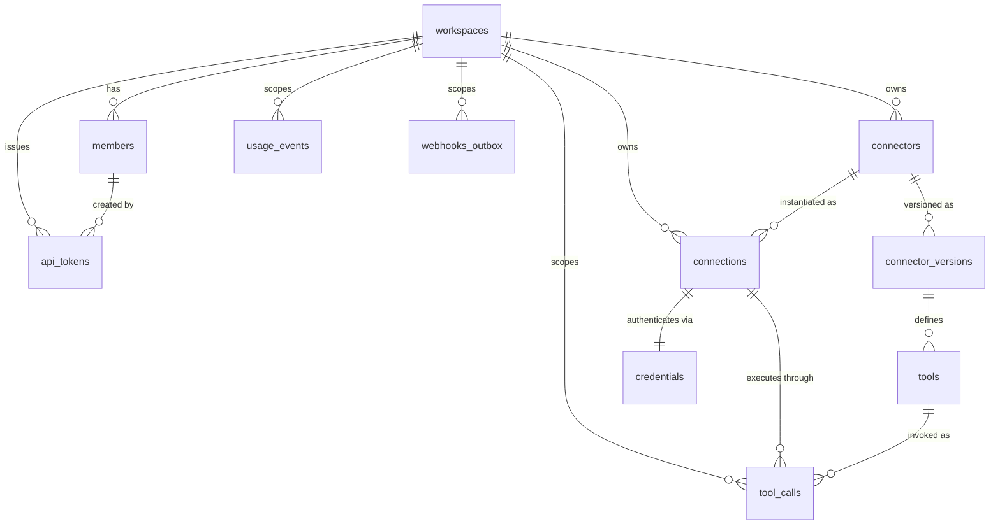

# Database Design

> Consistent with docs/MASTER_PROJECT_BIBLE.md. Tenancy model per ADR-0004; migration
> tooling per Bible §7 (Alembic, SQLAlchemy 2 async, PostgreSQL on Neon).
>
> Version 1.0 · 2026-08-02

This document defines the schema conventions, the core entity-relationship model, the
indexing strategy, and the migration rules for the OmniAI Connect PostgreSQL database.
It is a specification: tables described here WILL be created by Alembic migrations as
their owning domains are built (see ROADMAP.md milestones).

## 1. Conventions

- **Naming.** `snake_case` for tables, columns, indexes, and constraints. Tables are
  plural nouns from the canonical domain model (Bible §4): `workspaces`, `connectors`,
  `connections`, `tools`, `tool_calls`, `credentials`. Indexes: `ix_<table>_<cols>`;
  unique constraints: `uq_<table>_<cols>`; foreign keys: `fk_<table>_<col>`.
- **Primary keys.** `id UUID` using **UUIDv7** (time-ordered), generated
  application-side. UUIDv7 keeps B-tree inserts append-friendly (unlike UUIDv4) while
  remaining non-guessable and safe to expose in URLs and API responses.
- **Timestamps.** Every table carries `created_at timestamptz NOT NULL DEFAULT now()`
  and `updated_at timestamptz NOT NULL` (maintained by the SQLAlchemy base mixin).
  All times are UTC; `timestamp without time zone` is forbidden.
- **Tenancy.** Every tenant-owned table carries `workspace_id UUID NOT NULL` referencing
  `workspaces.id`. The only tables without it are `workspaces` itself and global
  reference data (none in v1). Enforced by the shared `WorkspaceScopedBase` mixin and by
  Postgres RLS (§6).
- **Soft delete.** Applied **only where the product requires undo or historical
  integrity**: `connectors`, `connections`, and `tools` use `deleted_at timestamptz NULL`
  (a deleted Connection must not orphan its audit history). Everything else is
  hard-deleted; `tool_calls` and `usage_events` are append-only and never deleted in-band
  (retention is handled by partition dropping, §5). Credentials are hard-deleted on
  revocation — we do not keep dead secrets, even encrypted.
- **Enums.** Stored as `text` with a `CHECK` constraint, not native Postgres enums
  (native enums make additive migrations awkward). Allowed values live in one Python
  module per domain.

## 2. Core ERD



## 3. Table-by-table

### workspaces
The tenant root (Bible §4). Columns: `id`, `name`, `slug` (unique, URL-safe), `plan`
(`free|pro|team|enterprise`), `stripe_customer_id NULL`, timestamps. No `workspace_id`
on itself. Billing state beyond the plan pointer lives with Stripe, not here.

### members
A user's membership in a Workspace with a role. Columns: `id`, `workspace_id`,
`user_id` (Better Auth subject identifier — identity itself lives in the Next.js layer
per ADR-0002), `role` (`owner|admin|member|viewer`), `invited_by NULL`, timestamps.
Unique on `(workspace_id, user_id)`. Human identity maps to a Member on every API
request; machine identity does not (see `api_tokens`).

### api_tokens
Workspace-scoped machine credentials for AI clients and Interfaces (MCP, REST, SDKs) —
distinct from human sessions per ADR-0002. Columns: `id`, `workspace_id`,
`created_by_member_id`, `name`, `token_hash` (SHA-256 of the secret; plaintext shown
once at creation, never stored), `token_prefix` (first 8 chars, for display and lookup),
`scopes` (`jsonb`), `last_used_at NULL`, `expires_at NULL`, `revoked_at NULL`,
timestamps. Unique on `token_hash`.

### connectors
A definition of an external API: its Tools, auth requirements, and base config
(Bible §4). Columns: `id`, `workspace_id`, `name`, `slug` (unique per workspace),
`source_type` (`openapi3|swagger2|graphql|manual`), `source_url NULL`, `base_url`,
`auth_config` (`jsonb` — auth *requirements*, never secrets), `status`
(`draft|ingesting|active|failed`), `current_version_id NULL` (FK to
`connector_versions`), `deleted_at NULL`, timestamps.

### connector_versions
Immutable snapshots of a Connector's ingested definition (CONNECTOR_ENGINE.md §6).
Columns: `id`, `workspace_id`, `connector_id`, `version` (monotonic integer per
connector), `spec_hash` (content hash of the normalized spec — dedupes no-op re-syncs),
`raw_spec_ref NULL` (R2 object key for the original document), `normalized_schema`
(`jsonb` — the canonical Tool Schema set), `diff_summary` (`jsonb NULL` — added/removed/
changed tools vs. previous version), `created_at`. Rows are never updated or deleted.
Unique on `(connector_id, version)`.

### tools
One callable operation exposed by a Connector (Bible §4), denormalized from its
`connector_version` for query and export speed. Columns: `id`, `workspace_id`,
`connector_id`, `connector_version_id`, `name` (canonical tool name, unique per
connector version), `description`, `input_schema` (`jsonb`, JSON Schema),
`output_hints` (`jsonb NULL`), `annotations` (`jsonb` — read-only vs destructive,
rate hints, tags per CONNECTOR_ENGINE.md), `enabled boolean NOT NULL DEFAULT true`,
`deleted_at NULL`, timestamps.

### connections
A workspace's authenticated instance of a Connector (Bible §4). Columns: `id`,
`workspace_id`, `connector_id`, `name`, `status`
(`pending_auth|active|error|revoked`), `credential_id NULL` (FK to `credentials`;
NULL only while `pending_auth`), `config_overrides` (`jsonb` — e.g. base URL override,
per-connection tool enablement), `last_health_check_at NULL`, `deleted_at NULL`,
timestamps.

### credentials
An encrypted secret bound to a Connection — radioactive per Bible tenet 2. Columns:
`id`, `workspace_id`, `connection_id`, `credential_type`
(`api_key|bearer|basic|jwt|oauth2|custom_headers`), `ciphertext bytea NOT NULL`
(AES-256-GCM envelope-encrypted blob), `encrypted_dek bytea NOT NULL` (data key wrapped
by the master KEK), `key_version int NOT NULL` (which KEK wrapped the DEK — enables
rotation), `nonce bytea NOT NULL`, `expires_at NULL` (OAuth token expiry, drives the
refresh worker), `rotated_at NULL`, timestamps. **Plaintext never touches this table,
logs, or API responses**; decryption happens only inside the Execution Runtime
(AI_RUNTIME.md). No soft delete — revocation deletes the row.

### tool_calls
Append-only audit of every Tool Call (Bible §4: "always audit-logged"). High-volume
and **partition-ready from day one**: declared `PARTITION BY RANGE (created_at)` with
monthly partitions, so the ClickHouse/partition-pruning path in SYSTEM_ARCHITECTURE.md
§6 needs no re-DDL. Columns: `id`, `workspace_id`, `connection_id`, `tool_id`,
`request_id` (correlates with logs), `caller` (`jsonb` — interface type, api_token_id
or member_id), `status` (`succeeded|failed|denied|timeout`), `input_summary`
(`jsonb` — redacted/truncated arguments), `output_summary` (`jsonb` — truncated
response metadata, never raw secrets), `error_code NULL`, `duration_ms int`,
`created_at`. No `updated_at`: rows are immutable. PK is `(id, created_at)` as
partitioning requires the partition key in the PK.

### usage_events
Billing meter feed (Bible §11: usage metered per Tool Call). Columns: `id`,
`workspace_id`, `event_type` (`tool_call_executed|...`), `tool_call_id NULL`,
`quantity int NOT NULL DEFAULT 1`, `occurred_at timestamptz`, `reported_at NULL`
(when pushed to Stripe), `created_at`. Append-only; aggregated by a Celery task.
Kept separate from `tool_calls` so billing semantics can evolve without touching the
audit trail.

### webhooks_outbox
Transactional outbox for outbound notifications (async tool-call completion, connection
health alerts). Columns: `id`, `workspace_id`, `event_type`, `payload` (`jsonb`),
`destination_url`, `status` (`pending|delivering|delivered|dead`), `attempts int`,
`next_attempt_at NULL`, `delivered_at NULL`, timestamps. Written in the same
transaction as the domain change; drained by a Celery worker with exponential backoff.
This is the same outbox pattern the event bus will lean on when the in-process bus
moves to a broker (ADR-0001).

## 4. Indexing strategy

- **Composite indexes lead with `workspace_id`.** Every access path is
  workspace-scoped (Bible tenet 1), so indexes are `(workspace_id, <selective col>)`:
  e.g. `ix_tools_workspace_connector (workspace_id, connector_id)`,
  `ix_connections_workspace_status (workspace_id, status)`,
  `ix_tool_calls_workspace_created (workspace_id, created_at DESC)` for the log UI.
- Lookups that arrive without workspace context first — `api_tokens.token_hash`,
  `workspaces.slug` — get their own unique indexes; the resolved workspace scopes
  everything after.
- `tool_calls` gets `(workspace_id, connection_id, created_at DESC)` for per-connection
  drill-down; partition pruning on `created_at` keeps these small.
- `jsonb` columns get GIN indexes only when a real query needs them (none in v1);
  we do not index speculatively.
- Foreign keys always get a supporting index (Postgres does not create one implicitly).

## 5. Migration rules

1. **Alembic only.** No manual DDL against any environment, ever. Schema-first per
   Bible tenet 5: the migration lands in the same PR as the model change.
2. **One migration per PR.** Multiple heads are a merge failure; CI checks
   `alembic heads` returns exactly one.
3. **Always reversible** — every migration ships a real `downgrade()`. If a migration
   is genuinely irreversible (e.g. dropping a column with data), the `downgrade()`
   raises with an explicit message and the PR description documents why.
4. **No data migrations mixed with schema migrations.** Backfills are separate
   migrations (or Celery one-off tasks for large tables) so schema changes stay fast
   and lock-light on Neon.
5. **Additive-first.** Expand → migrate → contract for renames and type changes; no
   destructive change in the same release that introduces its replacement.
6. Partitioned tables (`tool_calls`): partition creation is automated (a scheduled task
   creates the next month ahead of time); migrations never assume a specific partition
   exists.

## 6. Row-Level Security (per ADR-0004)

RLS is **defense-in-depth**, not the primary isolation mechanism — the repository layer
(BACKEND_SPEC.md §3) remains responsible for scoping every query by `workspace_id`.
From milestone M1, every tenant table gets:

```sql
ALTER TABLE tools ENABLE ROW LEVEL SECURITY;
CREATE POLICY tenant_isolation ON tools
  USING (workspace_id = current_setting('app.workspace_id')::uuid);
```

The session-scoped `app.workspace_id` GUC is set by the UnitOfWork when a request's
workspace context is bound. Application roles do not hold `BYPASSRLS`; only the
migration role does. RLS policies are created in Alembic migrations like any other DDL
and covered by integration tests that assert cross-tenant reads return zero rows.
